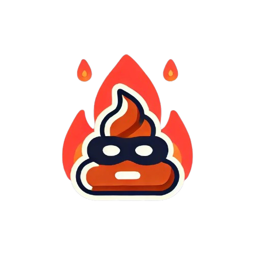

# 🔥 Inferno Token Burner

<p align="center">
  
</p>

<p align="center">
  <strong>Send your unwanted spam tokens straight to hell, where they belong!</strong>
</p>

<p align="center">
  <a href="https://tokenburner.vercel.app" target="_blank">🌐 Live Demo</a> •
  <a href="#-features">✨ Features</a> •
  <a href="#-getting-started">🚀 Getting Started</a> •
  <a href="#-contributing">🤝 Contributing</a> •
  <a href="#%EF%B8%8F-license">⚖️ License</a>
</p>

## 👹 About

Inferno Token Burner is a web application that lets you **permanently destroy** unwanted ERC-20 tokens by sending them to a burn address (`0x000000000000000000000000000000000000dEaD`). 

Received spam tokens in your wallet? Phishing attempts? Annoying airdrops? **Burn them all!**

Instead of ignoring them in your wallet forever, enjoy the satisfying experience of watching them burn in hellfire with visual effects and demonic sounds!

## ✨ Features

- 🔥 **Burn Any ERC-20 Token**: Connect your wallet and incinerate unwanted tokens with a few clicks
- 🌐 **Multi-Chain Support**: Works across multiple EVM-compatible networks
- 👿 **Demonic Theme**: Satisfying burn animations and sinister sound effects
- 🏆 **Combo System**: Build your burning streak and achieve higher ranks
- 📜 **Burn History**: Track your token burning achievements
- 🛡️ **Safe & Secure**: No approvals required, just standard token transfers
- 🎵 **Evil Soundscape**: Toggle demonic sound effects for the full experience
- 🌙 **Dark Mode**: Easy on the eyes, as all burning should be
- 🔒 **Privacy First**: No tracking, no data collection, everything stays local

## 📋 Requirements

- Web3 wallet (MetaMask, Coinbase Wallet, WalletConnect, etc.)
- ERC-20 tokens you want to burn
- A desire to cleanse your wallet of digital impurities

## 🚀 Getting Started

### For Users

Simply visit [tokenburner.vercel.app](https://tokenburner.vercel.app) and start burning!

### For Developers

Clone and run the Inferno Token Burner locally:

```bash
# Clone this repository
git clone https://github.com/ottodevs/tokenburner.git

# Navigate to the project
cd tokenburner

# Install dependencies
bun install

# Run the development server
bun dev
```

Open [http://localhost:3000](http://localhost:3000) in your browser to see the result.

## 🧪 Tech Stack

- ⚡ **Next.js 15** - React framework with app router
- 🔗 **wagmi** & **viem** - Ethereum hooks and utilities
- 🎨 **Tailwind CSS** - Utility-first CSS framework
- 🔄 **Zustand** - State management
- 🎵 **Web Audio API** - For demonic sound effects

## 🔐 Privacy

**Your privacy is a priority**

- 🚫 **No data collection**: It doesn't collect any personal information
- 💾 **Local storage only**: All burn history is saved exclusively in your browser
- 🔥 **No tracking**: No user tracking (cypherpunk at heart)
- 🧠 **Your wallet, your choice**: It never access anything beyond what you explicitly approve

## ⚠️ Token Compatibility

While Inferno Token Burner works with most standard ERC-20 tokens, some demonic tokens might resist our burning ritual:

- Some tokens implement custom transfer functions that may reject burning attempts
- Since ERC-20 tokens inherit from abstract interfaces, developers can modify core functions
- Tokens with transfer restrictions, blacklists, or non-standard implementations might fail

But fear not! The vast majority of spam tokens follow standard implementations and will burn satisfyingly in our hellfire.

## 🔮 Future Rituals (Coming Soon)

The dark lords have whispered plans for future enhancements:

- 📜 **Collaborative Blacklist**: Submit token addresses to create a community-driven spam token registry
- 🔄 **Batch Burning**: Incinerate multiple tokens in a single transaction (v2)
- ⛽ **Gas Estimation**: Calculate the cost of your burning satisfaction beforehand
- 🖼️ **NFT Burning**: Extend purification rituals to unwanted NFTs
- 🏆 **Burning Attestations**: Generate on-chain proof of your purification efforts
- 🧙 **Summoning Rituals**: Generate new NFTs from the ashes of your burned tokens

## 🤝 Contributing

Contributions are what make the open-source community such an amazing place to learn, inspire, and create. Any contributions you make are **greatly appreciated**.

1. Fork the Project
2. Create your Feature Branch (`git checkout -b feature/AmazingFeature`)
3. Commit your Changes (`git commit -m 'Add some AmazingFeature'`)
4. Push to the Branch (`git push origin feature/AmazingFeature`)
5. Open a Pull Request

Some ideas for contributions:
- Add support for more chains
- Create new burn animations
- Add more demonic sound effects
- Implement social sharing features
- Add token blacklist/warning system for valuable tokens

## ⚖️ License

Distributed under the MIT License. See `LICENSE` for more information.

## 👹 Disclaimer

This tool is meant for removing unwanted spam tokens from your wallet. **Never burn tokens with actual value**. Once tokens are sent to the burn address, they cannot be recovered under any circumstances!

Some tokens may fail to burn due to non-standard implementations. This is normal and a result of custom transfer function logic in those tokens.

In that case, most wallets will simulate the transfer and show a failed transaction before it is sent, so you can cancel it.

---

<p align="center">
  Built with 🔥 by demonic development, for the cleansing of all wallets
</p>
